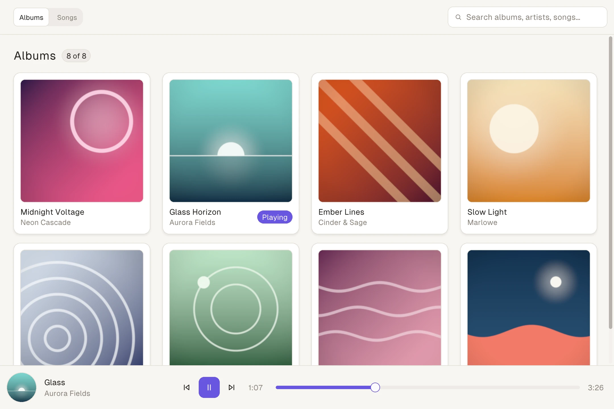

# Native SDK

<p>
  <a href="https://vercel.com/labs#active-experiments"></a>
  <a href="https://www.npmjs.com/package/@native-sdk/cli"></a>
  <a href="https://github.com/vercel-labs/native/blob/main/LICENSE"></a>
  <a href="https://www.npmjs.com/package/@native-sdk/cli"></a>
</p>

Native SDK is a toolkit for building native desktop applications with TypeScript and Native markup. The toolkit compiles app logic and views into a native executable and renders the interface in OS windows. Zig cores and optional embedded web content are also supported.

Native SDK is experimental. Platform capabilities vary, and mobile support is still evolving. See the [platform support matrix](https://native-sdk.dev/docs/platform-support) for current support.

## Quick start

Install the CLI with Node.js 24 or later:

```bash
npm install -g @native-sdk/cli
```

Create and run an app:

```bash
native init my_app
cd my_app
native dev
```

The generated project opens a counter app and includes:

- `src/core.ts`: the app's model, messages, and update function.
- `src/app.native`: the view, with layout, bindings, and message dispatch.
- `app.json`: app identity, windows, permissions, and security settings.

`native dev` watches markup changes and updates the view while preserving app state. TypeScript core changes rebuild and restart the app. Use `native dev --core` to exercise core logic under Node.js without opening a window, `native check` to validate the project, and `native build` to create a release binary.

The CLI uses a compatible Zig toolchain from your `PATH` or offers to download the pinned version. See [Quick Start](https://native-sdk.dev/docs/quick-start) for platform prerequisites and the complete workflow.

## App model

Events dispatch typed messages to `update`, which returns the next model and any effects. The view derives its content from the model. Filesystem access, network requests, and other external work run through effects and TypeScript services.

App cores use a checked TypeScript subset and compile to native code. To write a Zig core instead, create the project with `native init my_app --template zig-core`. See [App Model](https://native-sdk.dev/docs/app-model) and [TypeScript Cores](https://native-sdk.dev/docs/typescript).

## Examples

<picture>
  <source media="(prefers-color-scheme: dark)" srcset=".github/assets/soundboard-dark.webp">
  
</picture>

The Soundboard example rendered by the Native SDK engine. More apps are in [examples/](./examples):

- [Chatbot](./examples/chatbot): streaming responses, text editing, and TypeScript effects.
- [Soundboard](./examples/soundboard-ts): audio playback, search, assets, and context menus.
- [System monitor](./examples/system-monitor-ts): subprocess effects, tables, charts, and timers.
- [Calculator](./examples/calculator): markup, keyboard input, and theming.

See the [example catalog](./examples/README.md) for additional apps and their authoring languages.

## Documentation

- [Quick Start](https://native-sdk.dev/docs/quick-start): installation and your first app.
- [Native UI](https://native-sdk.dev/docs/native-ui): markup, layout, and bindings.
- [Components](https://native-sdk.dev/docs/components): the built-in component catalog.
- [TypeScript Services](https://native-sdk.dev/docs/typescript/services): external work outside the core.
- [Testing](https://native-sdk.dev/docs/testing): headless app tests and runtime integration.
- [Automation](https://native-sdk.dev/docs/automation): inspect and drive a running app.
- [Packaging](https://native-sdk.dev/docs/packaging): create distributable packages.

## Contributing

See [CONTRIBUTING.md](./CONTRIBUTING.md) for repository setup and local checks. For larger changes, open an issue to discuss the design first.

## License

[Apache-2.0](./LICENSE)
